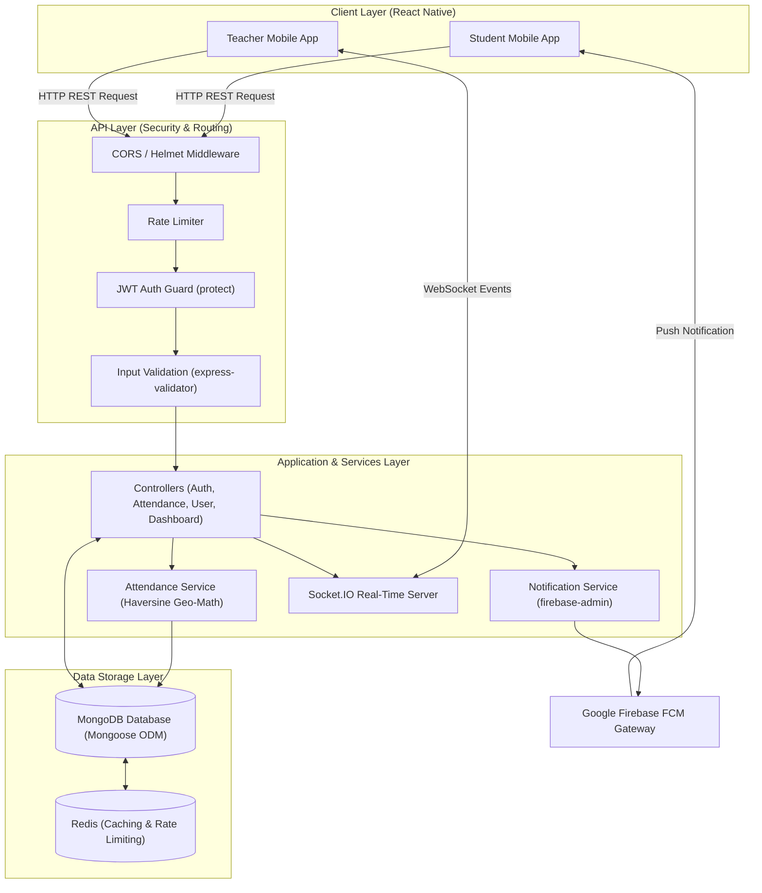
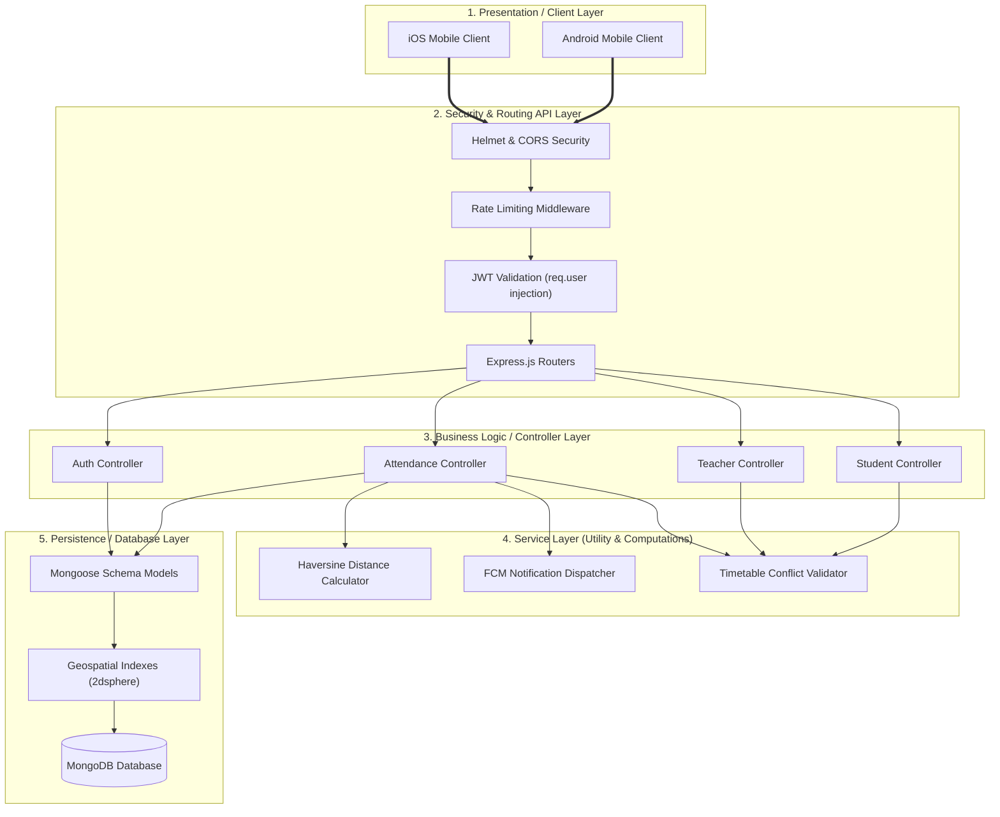
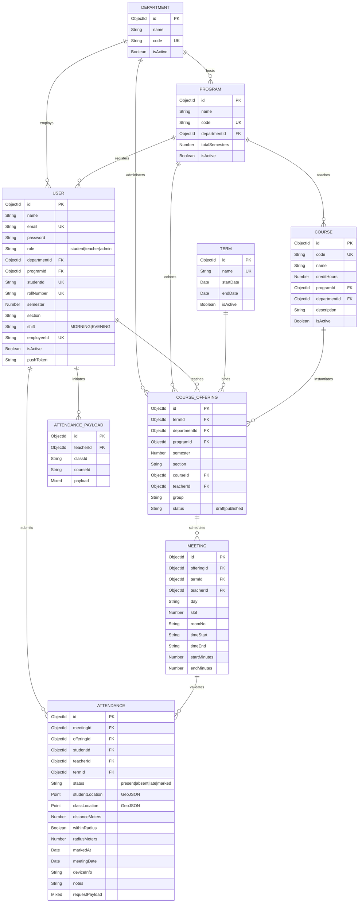
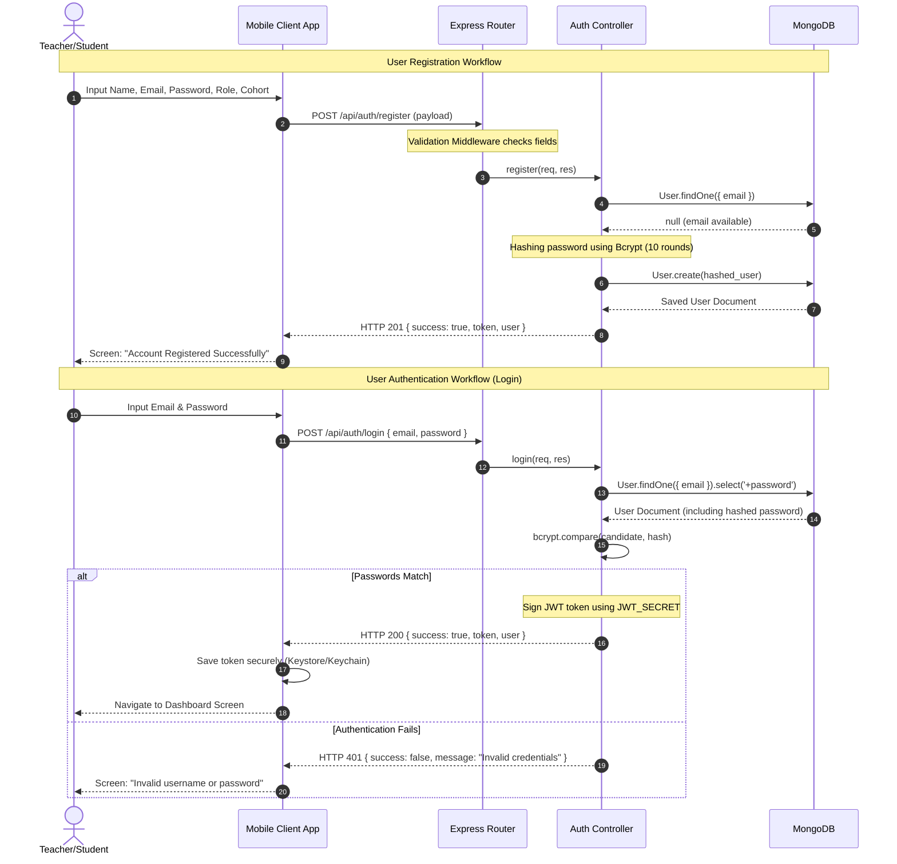
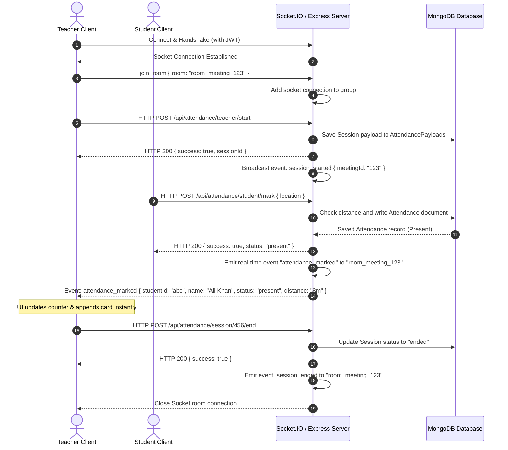
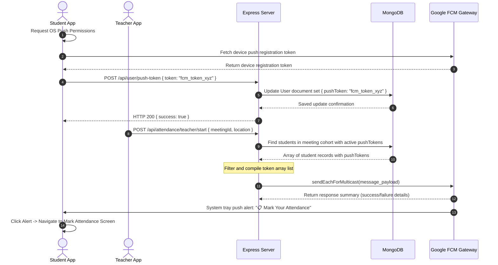
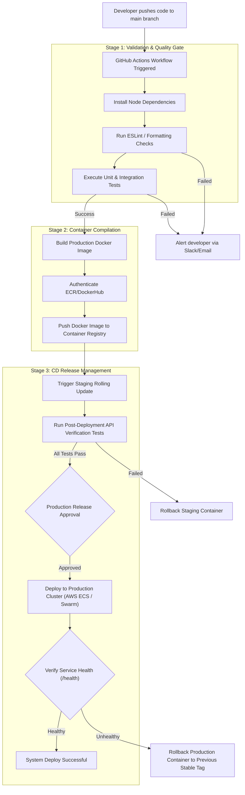

# Atendify Backend - System Engineering & Architecture Documentation

## 1. Project Overview

### Overview
**Atendify** is an academic-grade, mobile-enabled, automated student attendance management system engineered for high-education environments. Modern universities struggle with manual methods (e.g., paper sheets or roll-call) and fixed biometric kiosks that lead to bottlenecks and "proxy attendance" fraud. 

Atendify shifts the paradigm to **peer-to-peer geo-localization validation**. The backend orchestrates attendance sessions by performing coordinate validation between student and teacher mobile devices. Utilizing spherical coordinate math (Haversine formula), real-time notifications, and high-performance querying, the system guarantees automated attendance status determination.

### Problem Statement
Traditional attendance monitoring practices are plagued by three key flaws:
1. **Inefficiency and Time Overhead**: Manual roll-call consumes up to 10–15% of active lecture hours, particularly in large student cohorts (50+ students).
2. **Lack of Verifiability**: Paper sheets are susceptible to signature forgery, and physical attendance proxies are simple to coordinate.
3. **Infrastructure Bottlenecks**: Hardware-based biometric terminals (fingerprint/facial scanning) are capital-intensive, stationary, and create long physical queues before classes.

### Purpose
The purpose of the Atendify Backend is to serve as the secure, high-throughput, and scalable core application server. It coordinates user identities, maintains academic course structures, processes geo-validation, handles device synchronization through WebSockets and push notifications, and hosts the database layer.

### Objectives
* **Implement Geolocation Verification**: Calculate real-time geographic distance between student and teacher coordinates, auto-resolving attendance status.
* **Support Micro-Accuracy Validation**: Enforce distance limits down to sub-room radiuses (e.g., 10–30 meters) utilizing the Haversine formula.
* **Orchestrate Push Notifications**: Alert students instantly via Firebase Cloud Messaging (FCM) when a class session's attendance window opens.
* **Provide Live Session Monitoring**: Supply teachers with a live-updating dashboard summarizing student attendance submissions.
* **Ensure Robust Security and Auditability**: Validate device information and prevent spoofing by storing unique hardware indicators and request metadata.

### Scope
The backend boundary encapsulates:
* Role-based access control (RBAC) authorization models for Students, Teachers, and Admins.
* Academic schedule (Timetable) conflict resolution (detecting classroom and instructor scheduling conflicts).
* Location-based attendance marking and temporary class session tracking.
* High-performance aggregation pipeline generation for reporting and dashboard statistics.
* Secure infrastructure components including API rate-limiters, HTTP security headers, and query builders.

---

## 2. Backend Requirements

### Functional Requirements

| Requirement ID | Requirement Name | Description |
|---|---|---|
| **FR-01** | User Authentication | Users must be able to securely register, log in, and retrieve their profiles using JSON Web Tokens (JWT). |
| **FR-02** | Role-Based Access Control | Enforce structural route protection so that only authorized users (Admin, Teacher, Student) access respective endpoints. |
| **FR-03** | User Management | Admins must be able to activate, deactivate, update, and filter users (e.g., Student cohorts or Teacher designations). |
| **FR-04** | Session Management | Teachers must be able to start, check the status of, and end live attendance windows (persisting sessions in the database). |
| **FR-05** | API Management | Expose standard REST endpoints protected by validation middleware (`express-validator`) and standard response wrappers. |
| **FR-06** | Push Notifications | Push notification service must query the target cohort (Program, Semester, Section) and dispatch alerts via Firebase Cloud Messaging. |
| **FR-07** | Real-Time Updates | Emit events and updates (e.g., student attendance markings) to the teacher's active dashboard. |
| **FR-08** | Logging & Auditing | Log all incoming HTTP operations with timestamps, and store student request payloads for audit checks. |
| **FR-09** | Analytics & Aggregations | Perform database aggregations to provide students with attendance statistics and teachers with average distance summaries. |
| **FR-10** | Admin Controls | Allow system administrators to manage master catalogs (Departments, Programs, Terms, Courses, Course Offerings, and Rooms). |

### Non-Functional Requirements

| Requirement ID | Requirement | Description |
|---|---|---|
| **NFR-01** | Performance | Distance calculations and database reads must resolve in under 200ms for typical student queries under load. |
| **NFR-02** | Scalability | Database schema design and query indexing must support scaling to thousands of concurrent student requests during active schedule slots. |
| **NFR-03** | Reliability | The system must calculate distances using geographic-standard math (Haversine formula) to prevent false-absent errors. |
| **NFR-04** | Security | Store passwords as strong cryptographic hashes (Bcrypt, 10 salt rounds), enforce HTTPS, apply rate limits, and block NoSQL injections. |
| **NFR-05** | Availability | The platform must achieve 99.9% uptime, deploying resilient process handlers (uncaughtException/unhandledRejection fallbacks). |
| **NFR-06** | Maintainability | Adhere to a clean Controller-Service-Repository architecture with modular routes and decoupled services (FCM, geo-math). |

---

## 3. Technology Stack

| Technology | Purpose | Why Selected |
|---|---|---|
| **Node.js** | Runtime Environment | High concurrency, non-blocking I/O model based on the V8 engine, ideal for handling thousands of rapid, lightweight API requests. |
| **Express.js** | Web Framework | Lightweight, modular routing middleware ecosystem providing rapid request-response mappings and standard security plugin hooks. |
| **MongoDB** | Primary Database | Document-oriented storage matching JSON payload structures. Highly efficient for storing sparse records and supports native `2dsphere` geospatial indices. |
| **Mongoose** | Object Data Modeling (ODM) | Enforces schema validation, handles model typing, and simplifies aggregation generation, database indexing, and population. |
| **JWT (JSON Web Tokens)** | Stateless Authentication | Lightweight, cryptographically signed tokens allowing secure, stateless communication between mobile clients and the backend. |
| **Socket.IO** | Real-Time Sync | Abstracted WebSocket server offering automatic fallback, room-based grouping, and dynamic event dispatch to teacher dashboards. |
| **Firebase Cloud Messaging** | Notification Engine | Industry standard for reliable, cross-platform (iOS and Android) push notification deliveries to mobile clients. |
| **Redis** | Caching & State | (Assumed production enhancement) High-speed, in-memory store for tracking active Socket.IO connection IDs, rate limits, and temporary sessions. |
| **Multer** | Multipart File Parser | Middleware for parsing `multipart/form-data` uploads (e.g., student profile pictures, CSV roster imports). |
| **Cloud Storage** | Static Asset Hosting | Standard object store (e.g., AWS S3 or Firebase Storage) for persisting system backups and uploaded media. |
| **Docker** | Containerization | Standardized environment compilation container guaranteeing local dev configurations map exactly to staging and production. |

---

## 4. System Architecture

The Atendify Backend utilizes a multi-layered software engineering structure. By decoupling concerns across clear horizontal layers, the codebase is easier to test, secure, and modify.

* **Client Layer**: Mobile client apps (React Native) interact with the backend via REST endpoints and real-time Socket.IO channels.
* **API Layer (Routing & Middleware)**: Intercepts all incoming HTTP requests. Enforces security headers (Helmet), cross-origin rules (CORS), rate limiting (`express-rate-limit`), token authentication checking (`protect`), and field sanitization (`express-validator`).
* **Business Logic Layer (Controllers)**: Receives verified requests. Directs parameters to controllers (e.g., `attendanceController.js`, `authController.js`), coordinates data retrieval, and formats standard responses.
* **Service Layer**: Handles specialized external integrations and heavy calculations. Includes `attendanceService` (for geographic distance calculations and cohort lookups), `notificationService` (FCM multicast), and time slot conflict checks.
* **Database Layer (Data Access)**: Executes queries against the MongoDB database. Model mappings are performed using Mongoose ODM with custom middleware for schema validation, indices, and hashing.
* **Notification Layer**: Distributes out-of-band push notifications via Google/Apple push gateways to student handsets using FCM tokens.

### High-Level Architecture Diagram


### Layered Architecture Diagram


---

## 5. Database Design

### Entity Relationship Design
The database utilizes MongoDB's flexible schema mapping with Mongoose. Core academic entities (Department, Program, Course, Offering, Meeting, Term) link together to represent university schedules, while the user structure tracks roles and cohort attributes. The ER diagram below represents the logical references:



### Entity Tables

#### 1. Users (`users` collection)

| Field | Type | Constraints | Description |
|---|---|---|---|
| `_id` | ObjectId | Primary Key (Auto) | Unique object identifier. |
| `name` | String | Required, Trimmed | Full name of the user. |
| `email` | String | Required, Unique, Lowercase, MatchRegex | Institutional email address. |
| `password` | String | Required, Min Length 6, Select: false | Bcrypt hashed password. Excluded from query results. |
| `role` | String | Required, Enum: `student`, `teacher`, `admin`, Default: `student` | Role used for RBAC checks. |
| `departmentId` | ObjectId | Ref: `Department`, Default: null, Index | Department reference for teachers and staff. |
| `programId` | ObjectId | Ref: `Program`, Default: null, Index | Student's current degree program (e.g., BSCS). |
| `studentId` | String | Sparse, Unique, Trimmed | University register identification string. |
| `rollNumber` | String | Sparse, Unique, Trimmed | Student roll number. |
| `semester` | Number | Min 1, Max 8, Default: null | Student's current academic semester level. |
| `section` | String | MatchRegex: `^[A-Z]$`, Default: null | Single letter section code (A, B, C...). |
| `shift` | String | Enum: `MORNING`, `EVENING`, Default: `MORNING` | Student attendance slot shift. |
| `employeeId` | String | Sparse, Unique, Trimmed | Teacher employee ID. |
| `isActive` | Boolean | Default: true | Flag to activate or deactivate user accounts. |
| `pushToken` | String | Default: null | Firebase registration token for push notifications. |
| `createdAt` | Date | Auto Timestamp | Date when the user was created. |
| `updatedAt` | Date | Auto Timestamp | Date when user information was updated. |

#### 2. Departments (`departments` collection)

| Field | Type | Constraints | Description |
|---|---|---|---|
| `_id` | ObjectId | Primary Key | Unique object identifier. |
| `name` | String | Required, Unique, Trimmed | Department name (e.g., Computer Science). |
| `code` | String | Required, Unique, Uppercase, MatchRegex | Department code (2-6 letters, e.g., CS). |
| `isActive` | Boolean | Default: true | Active status flag. |
| `createdAt` / `updatedAt` | Date | Auto Timestamps | Database tracking records. |

#### 3. Programs (`programs` collection)

| Field | Type | Constraints | Description |
|---|---|---|---|
| `_id` | ObjectId | Primary Key | Unique object identifier. |
| `name` | String | Required, Trimmed | Program name (e.g., Bachelor of Computer Science). |
| `code` | String | Required, Unique, Uppercase | Program code (e.g., BSCS). |
| `departmentId` | ObjectId | Required, Ref: `Department`, Index | Reference to the hosting department. |
| `totalSemesters` | Number | Min 1, Max 10, Default: 8 | Standard duration of the program. |
| `isActive` | Boolean | Default: true | Active status flag. |
| `createdAt` / `updatedAt` | Date | Auto Timestamps | Database tracking records. |

#### 4. Terms (`terms` collection)

| Field | Type | Constraints | Description |
|---|---|---|---|
| `_id` | ObjectId | Primary Key | Unique object identifier. |
| `name` | String | Required, Unique, Trimmed | Term name (e.g., Spring-2026). |
| `startDate` | Date | Required | Start date of the academic term. |
| `endDate` | Date | Required, Validate > `startDate` | End date of the academic term. |
| `isActive` | Boolean | Default: false | Active semester flag (only one term should be active at a time). |

#### 5. Courses (`courses` collection)

| Field | Type | Constraints | Description |
|---|---|---|---|
| `_id` | ObjectId | Primary Key | Unique object identifier. |
| `code` | String | Required, Unique, Uppercase, MatchRegex | Course code in academic format (e.g., DCS-2004). |
| `name` | String | Required, Trimmed | Course name. |
| `creditHours` | Number | Required, Min 1, Max 6, Integer | Academic weight of the course. |
| `programId` | ObjectId | Ref: `Program`, Default: null | Optional degree program mapping. |
| `departmentId` | ObjectId | Ref: `Department`, Default: null | Department mapping. |
| `description` | String | Default: "" | Course syllabus summary. |
| `isActive` | Boolean | Default: true | Active status flag. |

#### 6. Course Offerings (`courseofferings` collection)

| Field | Type | Constraints | Description |
|---|---|---|---|
| `_id` | ObjectId | Primary Key | Unique object identifier. |
| `termId` | ObjectId | Required, Ref: `Term`, Index | Reference to the current academic term. |
| `departmentId` | ObjectId | Required, Ref: `Department` | Reference to the administering department. |
| `programId` | ObjectId | Required, Ref: `Program`, Index | Target program cohort. |
| `semester` | Number | Required, Min 1, Max 8 | Target cohort semester. |
| `section` | String | Required, Uppercase, MatchRegex: `^[A-Z]$` | Target cohort section. |
| `courseId` | ObjectId | Required, Ref: `Course`, Index | Reference to the course catalog. |
| `teacherId` | ObjectId | Required, Ref: `User`, Index | Assigned teacher. |
| `group` | String | Default: `MAIN`, Uppercase | Differentiator for lab groups (e.g., LAB-A). |
| `status` | String | Enum: `draft`, `published`, Default: `draft` | Status of the course offering. |

*Note: Compound unique index is enforced on `{ termId, programId, semester, section, courseId, teacherId, group }`.*

#### 7. Meetings (`meetings` collection)

| Field | Type | Constraints | Description |
|---|---|---|---|
| `_id` | ObjectId | Primary Key | Unique object identifier. |
| `offeringId` | ObjectId | Required, Ref: `CourseOffering`, Index | Reference to the parent offering. |
| `termId` | ObjectId | Required, Ref: `Term`, Index | Denormalized term reference. |
| `teacherId` | ObjectId | Required, Ref: `User`, Index | Denormalized teacher reference. |
| `day` | String | Required, Enum: Monday-Sunday | Day of the week when the class meets. |
| `slot` | Number | Required, Min 1, Max 10 | Daily schedule slot number. |
| `roomNo` | String | Required, Uppercase, Trimmed | Physical room code. |
| `timeStart` | String | Required, MatchRegex: `^([0-1]?[0-9]|2[0-3]):[0-5][0-9]$` | Start time (HH:MM format). |
| `timeEnd` | String | Required, MatchRegex: `^([0-1]?[0-9]|2[0-3]):[0-5][0-9]$` | End time (HH:MM format). |
| `startMinutes` | Number | Required (calculated on pre-save), Min 0, Max 1439 | Minutes since midnight. |
| `endMinutes` | Number | Required (calculated on pre-save), Validate > `startMinutes` | Minutes since midnight. |

*Note: Room conflicts are checked using the index `{ termId, day, roomNo, startMinutes, endMinutes }`.*

#### 8. Attendance (`attendances` collection)

| Field | Type | Constraints | Description |
|---|---|---|---|
| `_id` | ObjectId | Primary Key | Unique object identifier. |
| `meetingId` | ObjectId | Required, Ref: `Meeting`, Index | Reference to the meeting session. |
| `offeringId` | ObjectId | Required, Ref: `CourseOffering`, Index | Reference to the course offering. |
| `studentId` | ObjectId | Required, Ref: `User`, Index | Reference to the student. |
| `teacherId` | ObjectId | Required, Ref: `User`, Index | Reference to the teacher. |
| `termId` | ObjectId | Required, Ref: `Term`, Index | Reference to the term. |
| `status` | String | Required, Enum: `present`, `absent`, `late`, `marked`, Default: `marked` | Resolved attendance status. |
| `studentLocation` | Point | GeoJSON `{type: 'Point', coordinates: [lon, lat]}` | Geospatial index on student's location. |
| `classLocation` | Point | GeoJSON `{type: 'Point', coordinates: [lon, lat]}` | Geospatial index on teacher's location. |
| `distanceMeters` | Number | Required, Index | Calculated geographic distance. |
| `withinRadius` | Boolean | Required, Index | True if distance <= `radiusMeters`. |
| `radiusMeters` | Number | Required, Default: 10 | The validation radius used. |
| `markedAt` | Date | Default: `Date.now`, Index | Timestamp of submission. |
| `meetingDate` | Date | Required, Index | Calendar date of the class. |
| `deviceInfo` | String | Default: null | Client hardware footprint (e.g., iPhone 14 Pro). |
| `notes` | String | Default: null | Manual comments or exceptions. |
| `requestPayload` | Mixed | Default: null | Debug dump of student's request payload. |

*Note: Spatial indexing `studentLocation: '2dsphere'` and `classLocation: '2dsphere'` are configured for geospatial analysis.*

#### 9. Sessions (`attendancepayloads` collection)

| Field | Type | Constraints | Description |
|---|---|---|---|
| `_id` | ObjectId | Primary Key | Unique session identifier. |
| `teacherId` | ObjectId | Required, Ref: `User`, Index | Reference to the session-starting teacher. |
| `classId` | String | Required, Trimmed | Meeting ID representing the active lecture. |
| `courseId` | String | Required, Trimmed | Course Offering ID. |
| `payload` | Mixed | Required | Metadata payload storing location coordinates, active status, start/end timestamps, and device info. |
| `createdAt` / `updatedAt` | Date | Auto Timestamps | Session tracking parameters. |

---

## 6. Authentication & Authorization

Atendify uses stateless JSON Web Token (JWT) verification. The client sends user credentials to `/api/auth/login`, and upon successful match, the backend responds with a signed signature payload that must be appended to subsequent HTTP request headers: `Authorization: Bearer <JWT_TOKEN>`.

```
Authorization Flow:
[Mobile App] --- POST Credentials ---> [/api/auth/login]
[Mobile App] <--- Signed JWT Token --- [Express App Server]
[Mobile App] --- GET Request with Bearer Token ---> [/api/student/dashboard] (Validated by protect middleware)
```

### Registration Flow
1. **Input Sanitization**: `registerValidation` schema executes validation checks (e.g., verifies valid email, checks password length >= 6).
2. **Pre-Save Pass Hash**: Mongoose hook intercepts user schema saving, generates a cryptographic salt (10 rounds), and hashes the password via `bcrypt`.
3. **Database Insertion**: The new user record is stored. If the user's role is `student`, cohort parameters (`programId`, `semester`, `section`) are checked. For `teacher` roles, `departmentId` validation is enforced.
4. **JWT Generation**: Generates a web token containing the user ID and role, signed with the backend's private key (`JWT_SECRET`).

### Login Flow
1. **Lookup User**: The system queries the `User` collection by email, explicitly requesting the password field (by default excluded).
2. **Hash Comparison**: Candidate password matches are checked using `bcrypt.compare()`.
3. **JWT Dispatch**: If successful, returns the signed token. The client stores the token in secure device storage (e.g., Keychain/Keystore).

### Password Reset Flow
* Teachers and students can update their passwords by calling `/api/auth/update-password` with their active token. The payload must pass `updatePasswordValidation` (requires current password and new password).
* System Admins can override, block, or generate reset tokens directly via user management endpoints.

### Refresh Tokens & Session Lifespan
* The primary JWT includes an expiration duration (defaulting to `7d` in configuration).
* If a session expires, the app requires re-authentication or silent refresh (using secure HTTP-Only cookies mapping refresh identifiers in production).

### Role-Based Access Control (RBAC)
Authorizations are enforced via `protect` and `authorize` middleware combinations:
* `protect`: Decodes and verifies the token signature. If valid, fetches the user from the database and attaches it to `req.user`.
* `authorize(...roles)`: Verifies if `req.user.role` matches the expected endpoints (e.g., blocks students from accessing `/api/teacher/*` resources).

### Authentication Sequence Diagram


---

## 7. API Design

### API Endpoints Catalog

#### 1. Authentication Module (`/api/auth`)

| Endpoint | Method | Description | Auth Required |
|---|---|---|---|
| `/register` | `POST` | Register a new student or teacher user account. | Public |
| `/login` | `POST` | Authenticate user credentials and return a signed JWT. | Public |
| `/me` | `GET` | Get current user's profile information. | Bearer JWT |
| `/update-password` | `PUT` | Update current user's password (requires current & new passwords). | Bearer JWT |
| `/logout` | `POST` | Invalidate client-side session. | Bearer JWT |

#### 2. User Administration Module (`/api/user` or `/api/users`)

| Endpoint | Method | Description | Auth Required | Role |
|---|---|---|---|---|
| `/push-token` | `POST` | Register or update the user's Firebase FCM token. | Bearer JWT | Any |
| `/` | `GET` | Retrieve list of all users with search and role filters. | Bearer JWT | Admin |
| `/` | `POST` | Create a new user manually. | Bearer JWT | Admin |
| `/:id` | `GET` | Fetch details of a specific user. | Bearer JWT | Admin |
| `/:id` | `PUT` | Update details of a user. | Bearer JWT | Admin |
| `/:id` | `DELETE` | Soft/Hard delete a user from the system. | Bearer JWT | Admin |
| `/:userId/assign-course/:courseId` | `POST` | Assign student to course offering. | Bearer JWT | Admin |

#### 3. Course & Timetable Master Data (`/api/courses`)

| Endpoint | Method | Description | Auth Required | Role |
|---|---|---|---|---|
| `/` | `POST` | Create a new course entry in the catalog. | Bearer JWT | Admin |
| `/` | `GET` | Fetch all courses. | Bearer JWT | Any |
| `/rooms` | `POST` | Setup a classroom location profile. | Bearer JWT | Admin |
| `/timetable` | `POST` | Add a new weekly class meeting entry to the schedule. | Bearer JWT | Admin |
| `/timetable/my-schedule` | `GET` | Fetch active timetable schedules for current user. | Bearer JWT | Any |

#### 4. Attendance Core Engine (`/api/attendance`)

| Endpoint | Method | Description | Auth Required | Role |
|---|---|---|---|---|
| `/teacher/start` | `POST` | Start a class attendance window. Sets teacher location, fetches cohorts, and sends push notifications. | Bearer JWT | Teacher |
| `/active-session/:meetingId` | `GET` | Check if there is an active session running for a meeting. | Bearer JWT | Any |
| `/session/:sessionId/end` | `POST` | End an active attendance session. | Bearer JWT | Teacher |
| `/student/mark` | `POST` | Mark student attendance. Validates location, distance, and schedule constraints. | Bearer JWT | Student |
| `/student/history` | `GET` | Fetch attendance history for the authenticated student. | Bearer JWT | Student |
| `/meeting/:meetingId` | `GET` | Fetch student attendance records and metrics for a meeting. | Bearer JWT | Any |
| `/stats/offering/:offeringId` | `GET` | Fetch class attendance summary metrics for a course offering. | Bearer JWT | Any |
| `/test/notify-student` | `POST` | Debug endpoint to test FCM push notification structures. | Public | Any |

---

## 8. Real-Time Communication

Atendify implements a hybrid real-time network model:
1. **HTTP REST**: Used for initiating state changes (e.g., starting sessions, marking attendance).
2. **WebSocket (Socket.IO)**: Used for bi-directional event syncing to update dashboard displays in real time.

When a teacher launches a session:
* The teacher's client connects to the WebSocket namespace `/attendance` and joins a room mapped by the class ID: `room_${meetingId}`.
* When a student calls `/api/attendance/student/mark`, the backend performs geo-calculations and stores the attendance entry.
* After database saving, the backend uses the socket namespace to emit an `attendanceMarked` event containing the student's name, status, and distance metrics to `room_${meetingId}`.
* The teacher's app updates its live counter (e.g., "35 / 45 Present") and appends the student's record to the UI list in real time without polling the database.

```
Socket Events Payload Map:
- "join_meeting_room" (Payload: { meetingId, userId }): Join socket to room.
- "session_started" (Payload: { sessionId, meetingId }): Alerts active listeners.
- "attendance_marked" (Payload: { attendanceRecord }): Sent to teacher client.
- "session_ended" (Payload: { meetingId }): Forces client view update.
```

### Real-Time Update Sequence Diagram


---

## 9. Notification System

Push notifications alert students when an attendance session starts, helping them mark attendance before the window closes.

```
FCM Flow:
[Student App] --- Register pushToken ---> [/api/user/push-token] ---> Saved to MongoDB
[Teacher App] --- Initiates start ---> [App Server]
[App Server] --- Find cohort users --- [MongoDB]
[App Server] --- Multicast send (payload) ---> [Firebase FCM Services]
[Firebase FCM Services] ---> Push Alerts ---> [Student Devices]
```

### Flow & Components
1. **Token Registration**:
   * When the mobile application initializes on a student's handset, it requests push permissions from the OS (APNs/FCM).
   * Once approved, the device receives a unique `registrationToken`.
   * The client updates this token on the backend by calling `POST /api/user/push-token`. The backend stores this token on the user's document in the database (`pushToken`).
2. **Notification Processing**:
   * When a teacher starts a session, the backend calls `sendAttendancePush(students, meetingId, details)`.
   * It queries the matching cohort, filtering for students with a registered `pushToken`.
3. **Payload Dispatching**:
   * It builds a multicast notification payload:
     ```json
     {
       "notification": {
         "title": "📋 Mark Your Attendance",
         "body": "Data Structures class is in session"
       },
       "data": {
         "meetingId": "65abc123def456789xyz",
         "action": "MARK_ATTENDANCE"
       },
       "tokens": ["device_token_1", "device_token_2"]
     }
     ```
   * The backend sends the payload using `firebase-admin/messaging` via `sendEachForMulticast()`.
4. **Retry & Failures**:
   * The Firebase response returns `successCount` and `failureCount`.
   * If a token fails with an error (like `messaging/registration-token-not-registered`), the backend identifies the invalid token, and can clear or update it in the database.

### Notification Sequence Diagram


---

## 10. Security Architecture

The Atendify Backend applies multiple layers of security to protect university records and prevent identity spoofing:

1. **State-Locked Authentication**:
   JWT access tokens are cryptographically signed using `HMAC-SHA256`. The signature validation verifies token authenticity before routing requests to controller logic.
2. **Password Cryptography**:
   Passwords are never stored in plain text. They are hashed using `Bcrypt` with 10 salt rounds before database insertion. Salt derivation prevents table matching attacks.
3. **Rate Limiting**:
   To prevent brute-force attacks and denial-of-service attempts, `express-rate-limit` controls call frequencies:
   * Global limit: Maximum of 100 requests per 15 minutes per IP address.
   * Exceeding the threshold returns `429 Too Many Requests`.
4. **CORS Security**:
   Cross-Origin Resource Sharing (CORS) is configured using whitelisted domain boundaries to ensure only official web portals and verified clients make cross-origin calls.
5. **HTTP Headers Shielding**:
   Integrates `Helmet` middleware to automatically set secure HTTP headers:
   * Blocks MIME-type sniffing (`X-Content-Type-Options`).
   * Restricts clickjacking attempts (`X-Frame-Options`).
   * Enforces secure transport layer configurations.
6. **Input Sanitization & Schema Guards**:
   Integrates `express-validator` to sanitize user-provided data. This validates field formats (e.g., checking email addresses and bounding numeric coordinates).
7. **NoSQL Injection Block**:
   Mongoose schema typing filters input parameters, stripping raw MongoDB operators (like `$gt`, `$ne`, or `$where`) to block query manipulation attacks.
8. **XSS Protection**:
   Incoming fields are parsed and escaped, preventing cross-site scripting (XSS) payloads from executing in client view frames.

---

## 11. Logging & Monitoring

* **Request Logging**:
  * In development mode, the system uses the `morgan('dev')` logger for colored console outputs of incoming requests.
  * In production, the system uses `morgan('combined')` to generate Apache-style log records, including client IP, response times, HTTP statuses, and user agent parameters.
* **Audit Trails & Payloads**:
  * Attendance submissions record student device footprints (`deviceInfo`) and exact request parameters (`requestPayload`).
  * If a student disputes an attendance result, admins can audit the saved payload to inspect the submitted coordinates.
* **Exceptions Log Management**:
  * Integrates process handlers `unhandledRejection` and `uncaughtException` to catch and log unexpected runtime errors without taking down the server.
* **Monitoring Strategy**:
  * A `/health` checkpoint endpoint is exposed for uptime tracking and orchestrator health checks.
  * Integrating performance monitors (like PM2 or Winston log rotation) helps manage server processes and logs.

---

## 12. Backend Folder Structure

The project directory structure separates components by responsibility:

```
Backend/
├── api/
│   └── index.js                 # Entry point wrapper (Vercel deployment target)
├── src/
│   ├── config/
│   │   └── database.js          # MongoDB database connection configuration
│   ├── controllers/
│   │   ├── attendanceController.js # Attendance verification logic
│   │   ├── authController.js    # Login, registration, profile recovery logic
│   │   ├── studentController.js # Student timetable and dashboard queries
│   │   └── teacherController.js # Teacher course, offering, and session controllers
│   ├── middleware/
│   │   ├── authMiddleware.js    # JWT validation, roles authorization checks
│   │   ├── db.js                # Database connection check middleware
│   │   ├── errorMiddleware.js   # API error and 404 response builders
│   │   └── validationMiddleware.js # express-validator checker wrapper
│   ├── models/
│   │   ├── Attendance.js        # Records student attendance records and geo-details
│   │   ├── AttendancePayload.js # Tracks active sessions initiated by teachers
│   │   ├── Course.js            # Master course database catalog
│   │   ├── CourseOffering.js    # Cohort assignments matching teachers to semesters
│   │   ├── Department.js        # Academic departments catalog
│   │   ├── Meeting.js           # Scheduled weekly lectures schedules
│   │   ├── Program.js           # Degree programs details
│   │   ├── Term.js              # Active academic terms
│   │   └── User.js              # Unified user schema (student/teacher/admin profiles)
│   ├── routes/
│   │   ├── attendanceRoutes.js  # Attendance routes (start, mark, end, stats)
│   │   ├── authRoutes.js        # Registration, login, password updates
│   │   ├── studentRoutes.js     # Timetable and course mappings for students
│   │   ├── teacherRoutes.js     # Meetings creation and dashboards for teachers
│   │   └── userRoutes.js        # Firebase push token configurations
│   ├── seeders/                 # Database population scripts for development
│   ├── services/
│   │   ├── attendanceService.js # Haversine calculator and enrollment lookups
│   │   ├── notificationService.js # Firebase push notification integration logic
│   │   └── timetableService.js  # Scheduled slot evaluations and constraints
│   ├── utils/
│   │   └── responseUtils.js     # Common response wrappers (sendSuccess, sendError)
│   ├── app.js                   # Main application initialization configuration
│   └── server.js                # Application bootstrapper and process listener
├── uploads/                     # Storage folder for temporary uploads and files
├── vercel.json                  # Serverless deployment configuration
├── .env.example                 # Environment configuration template
├── package.json                 # Node package configuration and scripts
└── package-lock.json            # Version-locked package tree configurations
```

---

## 13. Testing Strategy

Quality assurance of the Atendify Backend follows a multi-tiered test structure:

* **Unit Testing**: Tests core utility services and helpers (such as testing the Haversine geo-math function and payload data structures) in isolation.
* **Integration Testing**: Verifies component interactions, checking that course offering validation triggers timetable checks and schedules student cohorts correctly.
* **API Testing**: Automated testing of API endpoints (using Postman or Supertest) to verify routes, parameters, authentication states, and response structures.
* **Load Testing**: Simulates typical class slot peak loads (e.g., thousands of students marking attendance within a short window) to measure server response times and database query performance.

### API & Verification Test Cases

| Test Case ID | Scenario | Expected Result |
|---|---|---|
| **TC-AUTH-01** | Register user with duplicate email. | Returns `400 Bad Request` with an "Email already registered" error payload. |
| **TC-AUTH-02** | Attempt login with invalid credentials. | Returns `401 Unauthorized` and restricts session access. |
| **TC-AUTH-03** | Access protected `/api/teacher/offerings` without a JWT. | Returns `401 Unauthorized` with a "Not authorized" message. |
| **TC-AUTH-04** | Access teacher routes with a student role JWT. | Returns `403 Forbidden` from the authorization guard. |
| **TC-GEO-01** | Student marks attendance within class radius. | Returns `200 OK` and creates an attendance record marked as `present`. |
| **TC-GEO-02** | Student marks attendance outside class radius. | Returns `200 OK` and creates an attendance record marked as `absent`. |
| **TC-SCHED-01** | Student marks attendance before session starts. | Returns `400 Bad Request` indicating the session has not started. |
| **TC-SCHED-02** | Student marks attendance after session ends. | Returns `400 Bad Request` indicating the session has closed. |
| **TC-CONFLICT-01** | Teacher adds overlapping meeting slot for a room. | Returns `400 Bad Request` citing a schedule conflict. |

---

## 14. Deployment Architecture

Atendify uses a containerized deployment architecture to ensure consistent environments across Development, Staging, and Production.

1. **Development Environment**:
   Runs locally with `nodemon` and a local MongoDB instance. Configuration options are loaded from a `.env` file.
2. **Staging Environment**:
   Deployed on a staging server using Docker containers. The backend connects to a shared MongoDB database to verify configurations before production release.
3. **Production Environment**:
   Deployed on cloud infrastructure (like AWS or GCP) using a load balancer, container orchestrator (e.g., ECS or Kubernetes), a Redis caching cluster, and a MongoDB replica set.

### Deployment Diagram
```mermaid
graph TD
    %% Users
    UsersClient["Mobile Clients (iOS / Android)"]

    %% Load Balancing
    subgraph WebGateway ["Edge & Routing Gateway"]
        NginxProxy["Nginx Load Balancer / Reverse Proxy"]
        SSL["SSL / HTTPS Offloading"]
    end

    %% Application Clustering
    subgraph AppCluster ["Application Server Cluster (Docker Containers)"]
        NodeServer1["Atendify Node.js Container 1"]
        NodeServer2["Atendify Node.js Container 2"]
    end

    %% Notification Gateways
    FCMGateway["Google FCM Service API"]

    %% Database & Caching
    subgraph PersistenceCluster ["Data Persistence Layer"]
        RedisCache[("Redis (Cluster/Sentinel)")]
        subgraph MongoDBReplicaSet ["MongoDB Replica Set Cluster"]
            MongoPrimary[("MongoDB Primary Node")]
            MongoSecondary1[("MongoDB Secondary Node 1")]
            MongoSecondary2[("MongoDB Secondary Node 2")]
        end
    end

    %% Connections
    UsersClient -->|HTTPS Request (Port 443)| SSL
    SSL --> NginxProxy
    NginxProxy -->|Load Balances (Round Robin)| NodeServer1
    NginxProxy -->|Load Balances (Round Robin)| NodeServer2

    NodeServer1 -->|Write Active Session Cache| RedisCache
    NodeServer2 -->|Write Active Session Cache| RedisCache
    NodeServer1 -->|API Calls| FCMGateway
    NodeServer2 -->|API Calls| FCMGateway
    NodeServer1 ==>|Write/Read Operations| MongoPrimary
    NodeServer2 ==>|Write/Read Operations| MongoPrimary
    MongoPrimary -.->|Replication Sync| MongoSecondary1
    MongoPrimary -.->|Replication Sync| MongoSecondary2
```

---

## 15. CI/CD Pipeline

The Continuous Integration and Continuous Deployment (CI/CD) pipeline automates code validation, testing, container creation, and deployment.

### Pipeline Flow
1. **Lint & Formatting Check**: Code quality rules check for linting errors and formatting style.
2. **Unit & Integration Tests**: Automated tests run in isolated environments; failures halt the pipeline.
3. **Docker Build**: The pipeline builds a multi-stage Docker image, keeping production images lightweight.
4. **Push Registry**: Verified production images are pushed to a container registry (like Docker Hub or AWS ECR).
5. **Continuous Deployment**: The production cluster pulls the updated container image, performs a rolling update, and runs database migrations.

### Pipeline Flow Diagram


---

## 16. Future Enhancements

* **Advanced Biometrics Verification**:
  Support facial validation on student handsets to prevent proxy marking (e.g., student sharing their device within range).
* **Multi-Factor WiFi Handshake**:
  Cross-reference network MAC addresses or WiFi SSIDs alongside GPS coordinates to improve indoor accuracy in areas with weak GPS signals.
* **Offline Queue Synchronization**:
  Implement local storage synchronization on client apps, allowing students to queue attendance markings during network dropouts and sync once connectivity is restored.
* **Predictive Student Analytics**:
  Build analytics dashboards that analyze attendance trends, predicting students at risk of dropouts or academic probation.

---

## 17. References

1. **Express.js Documentation**: *Routing, API structures, and Middleware patterns.* [https://expressjs.com/](https://expressjs.com/)
2. **Mongoose API Guide**: *ODM schema definitions, indexing, and MongoDB validation.* [https://mongoosejs.com/](https://mongoosejs.com/)
3. **JSON Web Tokens (JWT) Spec (RFC-7519)**: *Stateless authentication patterns.* [https://jwt.io/](https://jwt.io/)
4. **Firebase Cloud Messaging Developer Portal**: *Push notifications and multicast notification structures.* [https://firebase.google.com/docs/cloud-messaging](https://firebase.google.com/docs/cloud-messaging)
5. **Haversine Formula Standard Reference**: *Spherical geo-distance math.* [https://en.wikipedia.org/wiki/Haversine_formula](https://en.wikipedia.org/wiki/Haversine_formula)
6. **Docker Containers Best Practices**: *Multi-stage container optimization.* [https://docs.docker.com/develop/develop-images/multistage-build/](https://docs.docker.com/develop/develop-images/multistage-build/)
